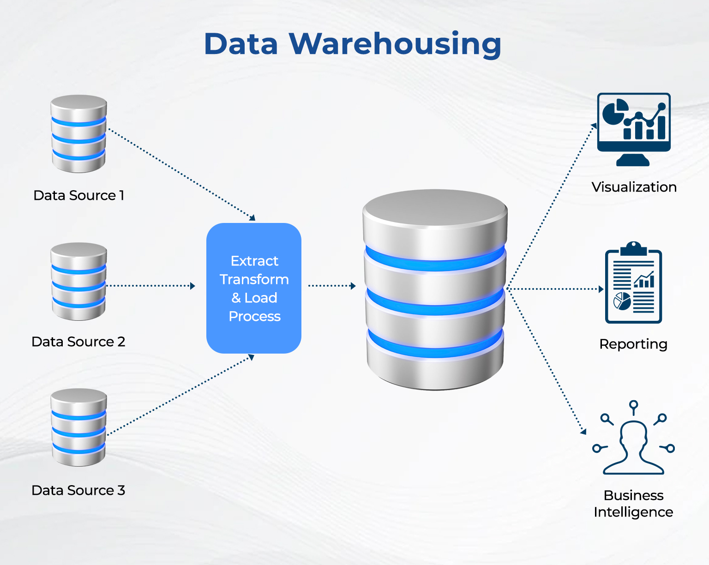

# Data Science and Database Technologies

## Description
A collection of advanced laboratory projects developed for the **Data Science e Tecnologie per le Basi di Dati** (Data Science and Database Technologies) course during the first semester of my Master's Degree in Computer Engineering at **Politecnico di Torino**. The repository spans the end-to-end modern data engineering lifecycle: large-scale Data Warehouse multidimensional design, business intelligence OLAP analytical querying, PL/SQL trigger automation and physical execution plan tuning, predictive machine learning pipelines in Python, and NoSQL document-oriented processing using MongoDB.

## Core Competencies & Topics Covered

* **Data Warehouse & Multidimensional Modeling:** Designing star and snowflake schemas, fact tables, dimension hierarchies, and aggregate materialized views for analytical workloads.
* **Advanced OLAP & Declarative Analytics:** Formulating complex SQL analytical queries leveraging window functions (`OVER`, `PARTITION BY`), ranking, and OLAP operators (`ROLLUP`, `CUBE`, `GROUPING SETS`).
* **Procedural Automation & Optimization:** Developing Oracle PL/SQL triggers, optimizing physical schema layouts, and evaluating SQL query execution plans (cost-based optimizer, indexing strategies).
* **Machine Learning Pipelines (Python):** End-to-end predictive modeling including dataset preprocessing, feature scaling, encoding, cross-validation, and classification models (Decision Trees, K-Nearest Neighbors, Naive Bayes).
* **NoSQL & Document Stores (MongoDB):** Schema design for semi-structured document collections, complex aggregation pipelines, filter stages, and Map-Reduce processing over large datasets.

## Technologies & Tools

* **Languages:** SQL, Python 3, MongoDB
* **Databases & Engines:** Oracle Database (OLAP/Data Warehousing), MongoDB (NoSQL)
* **Python Libraries:** `scikit-learn`, `pandas`, `numpy`, `matplotlib`
* **Tools:** Oracle SQL Developer, MongoDB Compass, Jupyter Notebooks